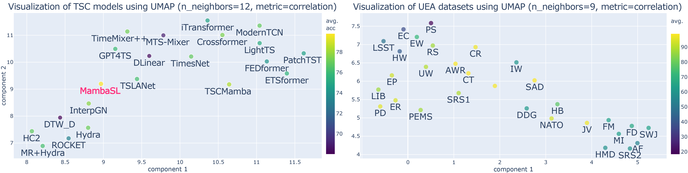
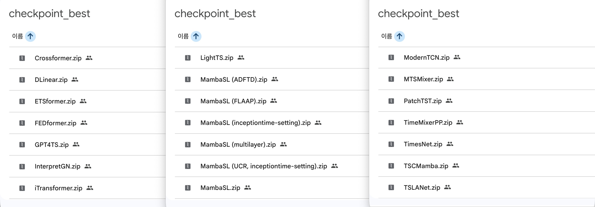

<div align="center">
<h4>ICLR 2026 ( <a href="https://openreview.net/forum?id=YDl4vqQqGP">OpenReview Paper</a>, <a href="https://iclr.cc/virtual/2026/poster/10008907">ICLR Video</a> )</h4>
<h2>MambaSL: Exploring Single-Layer Mamba for Time Series Classification</h2>
<h4>Yoo-Min Jung, Leekyung Kim &nbsp; @ Seoul National University</h4>
<!-- figure -->
<br>

<!--  -->

</div>


## 🗂️ TABLE OF CONTENTS
1. [Overview](#-overview)
2. [Preparation](#%EF%B8%8F-preparation)
3. [Training and Evaluation](#-training-and-evaluation)
    * [01-make_scripts](#01-make_scripts)
    * [02-run_scripts](#02-run_scripts)
    * [03-full_results](#03-full_results)
    * [04-retrieve_results](#04-retrieve_results)
    * [05-scripts_final](#05-scripts_final)
    * [06-visualize_results](#06-visualize_results)
    * [07-analysis_results](#07-analysis_results)
4. [Note](#-note)
5. [Citation](#-citation)
6. [Acknowledgement](#-acknowledgement)


## 🔎 Overview
### 💡 A minimally redesigned Mamba for time series classification (TSC) under four hypotheses
* **Scale input projection.**
Since <u>Mamba’s output is modulated by a gating unit, insufficient input context can bottleneck performance</u>, motivating a larger input projection receptive field for densely sampled time series.
* **Modularize time (in)variance.**
As <u>time series often exhibit near linear time-invariant behavior</u>, we decouple time variance of Mamba as a hyperparameter. 
Simpler configurations often perform better, contradicting the ablation results from Mamba.
* **Remove skip connection.**
Time series models often have shallow networks, and <u>skip connections do not always yield performance gains</u> in such cases.
Given <u>Mamba’s strong long-range memory</u>, we remove skip connections and construct logits solely from hidden states.
* **Aggregate via adaptive pooling.**
<u>Time series classification spans both global and event-driven patterns</u>, which conventional pooling cannot accommodate. We therefore propose a multi-head adaptive pooling that weights temporal features in a dataset-specific manner.

### 📊 Main Results
- Achieve the best average acc and rank on the UEA benchmark with a single-layer Mamba structure.
    

- Highlight systematic differences across backbone structures via UMAP visualization.
    

- Obtain best performing checkpoints of MambaSL and recent TSC baselines on all 30 datasets.
    


## ⚙️ Preparation

1. Install Python 3.12. (tested on 3.12.8)

    ```bash
    conda create -n ts312 python=3.12
    conda activate ts312
    ```


2. Install dependencies. 
    - For convenience, follow the instructions in the `./notebooks/initial setting.ipynb` to set up the environment. 
    - Or install the required packages as below:
        ```bash
        pip install -r "requirements (no version).txt"
        ```
        If you want to use the exact versions of the libraries that we used for our experiments, you can try the following command.
        ```bash
        pip install -r "requirements (now version).txt" --force-reinstall
        ```

    - As can be seen from the requirements files, we commented out `mamba-ssm` and `causal-conv1d` since they took a long time and may cause some error during installation. We **highly recommend installing `mamba-ssm` and `causal-conv1d` manually**. See more details in the `./notebooks/initial setting.ipynb` notebook.
    

3. Prepare Data. 
    - The original and preprocessed UEA30 datasets can be downloaded from [[Google Drive]](https://drive.google.com/drive/folders/1dJx_rpB7UnkMuxrCEoHJcXXzhaACS5Sx?usp=share_link).
        - Two versions are provided: 
        <br>(1) the original(`.ts`) and preprocessed(`.pkl`) UEA30 datasets, and 
        <br>(2) the dataset files above with additional feature files for TSCMamba model.
    - Place the datasets in the folder that you want and 
    **add or modify the `--root_path` flag** while running the `run.py` script for training or evaluation.

4. Prepare Checkpoints.
    - The checkpoints of MambaSL and other baselines are also provided in the [[Google Drive]](https://drive.google.com/drive/folders/1dJx_rpB7UnkMuxrCEoHJcXXzhaACS5Sx?usp=share_link).
    - Place the checkpoints in the folder that you want and 
    **add or modify the `--checkpoints` flag** while running the `run.py` script for evaluation.


## 🚀 Training and Evaluation
> **If you just want to test the best model on each dataset, go to [[05-scripts_final]](#05-scripts_final) section.**

> We provide all files related to our experiments under the `./scripts_classification/` directory. 
- The numbers in the directory correspond to the order in which the experiments were actually performed.

- The directory structure is as follows:
    ```text
    ./scripts_classification/
        ├── 01-make_scripts
        │   └── make_cls_script (${model}).sh
        ├── 02-run_scripts
        │   └── run_cls_script (${model}).sh
        ├── 03-full_results
        │   └── ${model} (${experiment})
        │       └── (experiment scripts and logs)
        ├── 04-retrieve_results
        │   ├── retrieve_results (MambaSL, multilayer).ipynb
        │   ├── retrieve_results (TSLib models).ipynb
        │   └── ...
        ├── 05-scripts_final
        │   ├── _template
        │   ├── _test_results
        │   ├── ${model}
        │       ├── All_UEA30.sh
        │       └── ${dataset}.sh
        │   └── run_scripts.sh
        ├── 06-visualize_results
        │   ├── ${model}
        │   ├── get_results (${model}).ipynb
        │   └── uea_interpgn.csv
        ├── 07-analysis_results
        │   ├── ablate_MambaSL_TV.ipynb
        │   ├── dataset_len.ipynb
        │   └── ...
        ├── data_classification.yaml : metadata of UEA30
        └── ...
    ```

### 01-make_scripts
> This folder contains the `.sh` files that we used to make scripts for hyperparameter grid search.
- In each file, you can see the details of the hyperparameters that we choose for a certain model.
- You can modify the `data_path` and other features in the files to generate your own set of experiment scripts.
- The generated scripts will be saved in either `./scripts_classification/scripts_baseline/` or `./scripts_classification/scripts_mamba/` as default.

### 02-run_scripts
> This folder contains the `.sh` files that we used to run the experiment scripts generated by [01-make_scripts].
- The experiment logs will be saved in `./scripts_classification/results/` as default.
- For instance, below is an example of running grid search experiments for MambaSL on DuckDuckGeese and PEMS-SF datasets *simultaneously*:
    ```bash
    UEA_MTSC30=("DuckDuckGeese" "PEMS-SF")
    
    exp="proposed"
    model="MambaSL_CLS"
    for dataset in ${UEA_MTSC30[@]}
    do
        datasetexp="${dataset}_${exp}"
        nohup bash ./scripts_classification/scripts_mamba/${exp}/${model}_${datasetexp}.sh > ./scripts_classification/results/${model}_${datasetexp}.out &
    done
    ```
    - Be aware of the memory limit of your GPU since the scripts will run simultaneously. 
        - Especially for the long sequence length (e.g., EigenWorms, MotorImagery) or high dimensionality (e.g. DuckDuckGeese, PEMS-SF).
        - You can run the scripts *sequentially* by removing `&` at the end of the `nohup` command. 

### 03-full_results
> This folder contains the full results (scripts and logs) of all experiments that we performed.
- We organized the results, which was temporarily saved in `./scripts_classification/results/` and `./scripts_classification/scripts_baseline/`, by models.
- You can check the performance of each hyperparameter setting for each model and dataset in the logs.
### 04-retrieve_results
> This folder contains the notebook files to retrieve the best checkpoints and the corresponding scripts from the [03-full_results].

### **05-scripts_final**
> This folder contains **the final scripts to test the best model on each dataset**.
- `_template/` : Script templates for UEA30 datasets. You can modify the template scripts to test the best model on each dataset.
- `_test_results/` : All test results of the final scripts that we ran for the paper.
- `${model}/`
    - `All_UEA30.sh` : A script to run the final scripts for all UEA30 datasets sequentially. Each script refers to the best & lightest checkpoint for each dataset.
    - `${dataset}.sh` : A script to run the final script for each dataset. It might contains multiple scripts if there are multiple best checkpoints for the dataset.<br><br>
    - **You have to modify the `gpu_id`, `resource_dir`, `data_dir`, and `checkpoint_dir` in the scripts properly** before running them.
        - `gpu_id` : GPU id (in integer) to run the script.
        - `resource_dir` : (optional) the path where you placed datasets and checkpoints. 
        - `data_dir` : the parent directory of the dataset folder. `${data_dir}/${dataset}/` will be used as the `--root_path` flag in the `run.py`.
        - `checkpoint_dir` : the path to the folder where you placed the best checkpoints downloaed from the Google Drive. `${checkpoint_dir}/${model}/` will be used as the `--checkpoints` flag in the `run.py`.<br><br>
- `run_scripts.sh`: Scripts that we used to run multiple final scripts with for loop.
    - Below is an example of running the final scripts for MambaSL on EthanolConcentration and Handwriting datasets *sequentially*:
        ```bash
        UEA_MTSC30=("EthanolConcentration" "Handwriting")

        model="MambaSL"
        for dataset in ${UEA_MTSC30[@]}
        do
            sh_fname="./scripts_classification/05-scripts_final/${model}/${dataset}.sh"
            out_fname="./scripts_classification/05-scripts_final/_test_results/${model}_${dataset}.out"
            nohup bash ${sh_fname} > ${out_fname}
        done
        ```
        if you add `&` at the end of the `nohup` command, you can run the scripts *simultaneously*. We don't recommend running too many scripts simultaneously due to the memory limit of the GPU.


### 06-visualize_results
> This folder contains the notebook files to visualize the results of the experiments.
- `${model}/` : This folder contains the outputs from `get_results (${model}).ipynb` notebook.
- `get_results (${model}).ipynb` : This notebook contains the code to summarize the accuracy results and draw some plots (e.g., line plot of accuracy vs. hyperparameters) although these were not included in our main paper.
- `uea_interpgn.csv` : full InterpGN results from the original repo.

### 07-analysis_results
> This folder contains the final analysis notebook codes and materials to reproduce the analysis results in our main paper.
- `ablate_MambaSL_TV.ipynb` : notebook to generate Figure 7
- `dataset_len.ipynb` : notebook to get the sequence length range for variable datasets, which was used for Table 4
- `visualization (adaptive pooling).ipynb` : notebook to generate Figure 8
- `visualization (UEA30 barplot).ipynb` : notebook to generate Figure 4
- `visualization (UMAP along ...).ipynb` : notebook to generate Figure 5 and 6
- `Wilcoxon test.ipynb` : notebook to perform Wilcoxon test for UEA30 results, which was used for Table 5


## 📝 Note

### Time-Series-Library
- The code is fundamentally built upon [Time-Series-Library#4ddf869](https://github.com/thuml/Time-Series-Library/tree/4ddf869d999424b037d451a4757e36813d66a13b).
- We modified dataloader to save and load the preprocessed datasets in pickle format for faster loading.
- We added the code for MambaSL and other baselines that weren't included in the original tslib.
- We modified some model due to proper hyperparameter search. The details can be found in each model file if there are any modifications.
    - e.g. change `seg_len` from fixed value to hyperparameter for Crossformer.
- We add experimental code for inceptiontime setting (to only use train loss for model selection), and medformer setting (to test ADFTD and FLAAP).

### TSLANet
- Since TSLANet has pretraining phase which make it difficult to merge into Time-Series-Library pipeline, we simply add `_run_TSLANet` directory to run the TSLANet pipeline. Still, the scripts can be generated and executed via `./scripts_classification/` directory.
- We changed dataloader and test code of TSLANet to make it work with original UEA30 datasets and saved model checkpoints.

### non-DL
- non-DL models were tested via [aeon-toolkit](https://www.aeon-toolkit.org/en/stable/).
- The notebooks in `_run_non-DL_models (aeon)` directory include the results.
- For MultiRocket+Hydra, padding was required in PenDigits dataset to avoid errors (seq_len 8 -> 9).

### Hardware and Software

- The scripts were tested on:
    - Four NVIDIA GTX 1080 Ti (11GB)
        - NVIDIA A100 (40GB) in Google Colab for some baselines due to the memory issue
    - Python 3.12.8 and PyTorch 2.5.1<br>(packages listed in `requirements (now version).txt`)


## 🔗 Citation
If you find this repo useful, please consider citing our paper:
```bibtex
@inproceedings{
  jung2026mambasl,
  title={Mamba{SL}: Exploring Single-Layer Mamba for Time Series Classification},
  author={Yoo-Min Jung and Leekyung Kim},
  booktitle={The Fourteenth International Conference on Learning Representations},
  year={2026},
  url={https://openreview.net/forum?id=YDl4vqQqGP}
}
```


## 🙌 Acknowledgement

- [Mamba](https://github.com/state-spaces/mamba) : 
We are really grateful to the authors of Mamba for sharing their code and providing us with the opportunity to explore the potential of Mamba in time series classification. In particular, leaving the parameters for Mamba's ablation study in the codebase was a great help for our research.

- [Time-Series-Library](https://github.com/thuml/Time-Series-Library) / [aeon-toolkit](https://www.aeon-toolkit.org/en/stable/) : We are also grateful to the creators and maintainers of the two time series libraries, which provided us with the codebase for DL and non-DL models, respectively.

- [UEA Archive](https://www.timeseriesclassification.com/) / [Medformer](https://github.com/DL4mHealth/Medformer) : We thank the authors of the UEA Archive and Medformer for sharing the well-preprocessed datasets which we used for our experiments.

- We also thank the authors of the baslines that we compared with for sharing their code and scripts, which we used to test the performance of the baselines in our experiments.
